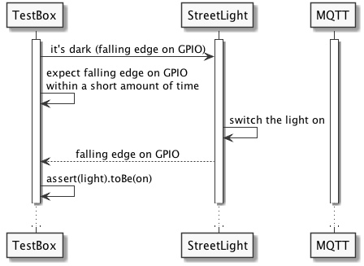
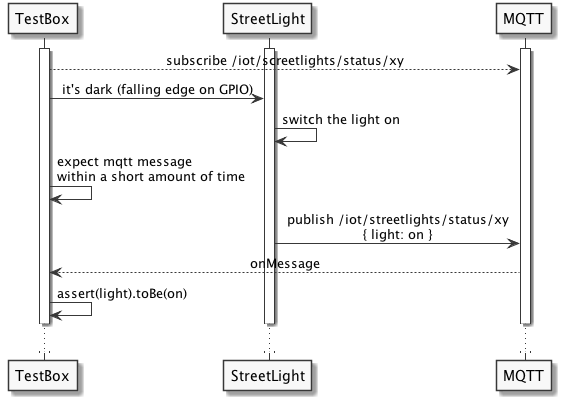

# testing-iot

Dies ist der Code für die Übungen der Stuttgarter Test-Tage 2017 (http://www.jugs.org/tt2017)


### Szenario

#### Das System Under Test
* Test einer in der Entwicklung befindlichen Straßenlaterne
* Kern der Straßenlaterne soll ein Raspberry Pi sein
* Es existiert bisher keine Hardware, die Software ist bereits in Entwicklung und soll getestet werden

#### Die Testbox

* Für den Test wird ein externer Raspberry Pi herangezogen: Die "Testbox"
* Auf der Testbox sollen tests für die Funktionalität der Straßenlaterne (SUT) laufen: Black-Box Test!
* Die Testbox ist über die GPIOs mit dem SUT verbunden
    * Die Testbox simuliert einen Helligkeitssensor
    * Die Testbox liest das Lichtsignal vom SUT ein

### Aufbau


#### Schematisch


### Die Übung

* Vorbereitet sind Tests in einem Java (Maven) Projekt zu finden unter ./testbox/java
   * mit Eclipse erstellt, .classpath und .project sind enthalten!
* In ```src/main/java/testbox/streetlight/testcases``` befinden sich drei Testfälle für die unten beschriebenen Sequenzen:
    * GPIO_GPIO
    * MQTT_GPIO
    * MQTT_MQTT
* In der Übung sollen:
  1. Die Entwicklungsumgebung "lauffähig" gemacht werden
  1. Die Testsequenzen verstanden werden
  1. **Der vierte Testfall GPIO_MQTT geschrieben werden.**
  1. Möglicherweise weitere Testfälle geschrieben werden (z.B. Sicherheitsapekte abprüfen?)


### Die Testsequenzen

##### GPIO_GPIO


##### MQTT_GPIO


##### MQTT_MQTT


##### GPIO_MQTT


### Die Tests laufen lassen

* Start der Tests über das Ausführen der Klasse ```testbox.TestRunner```
  * Vom PC aus können nur Tests ausgeführt werden, die keine GPIOs verwenden. Das wird von dem Testrunner automatisch erkannt.
* Das starten der Tests mit GPIOs geht nur direkt auf der Testbox
  * **Achtung: Da wir nur eine testbox haben, bitte in Absprache ausführen!**
  * Zum hochladen der Testsuite gibt es in der pom.xml ein Profil "autodeploy"
    * In der pom muss evtl. die property ```testbox.url``` angepasst werden
    * Es muss folgender Befehl ausgeführt werden (auch intern z.B. über Eclipse/IntelliJ möglich)
      * ```mvn package assembly:single -Pautodeploy```
      * Hier wird ein jar erstellt mit allen dependencies, dieses jar auf die testbox hochgeladen und dann die Tests ausgeführt.
